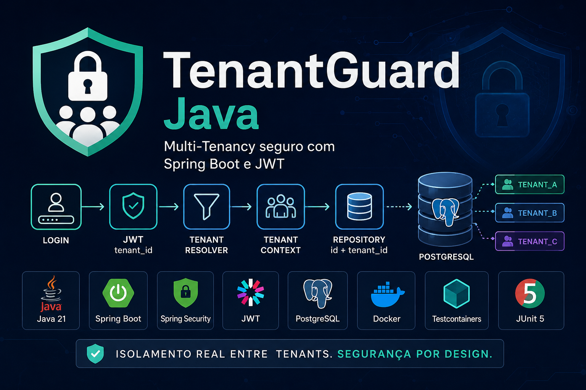

# 🛡️ TenantGuard Java

<p align="center">
  <a href="https://github.com/juceliocoelho2022/tenantguard-java/actions/workflows/ci.yml">
    
  </a>
  
  
  
  
  
</p>

<p align="center">
  
</p>

Projeto demonstrativo de **Multi-Tenancy seguro** desenvolvido com **Java 21 e Spring Boot**, com foco em isolamento de dados entre tenants, autenticação JWT, RBAC, PostgreSQL Row Level Security (RLS), OpenAPI/Swagger, Docker e testes de integração.

O objetivo é demonstrar, por meio de código e testes automatizados, como construir uma API SaaS em que cada tenant autenticado consegue acessar **somente os próprios dados**, utilizando defesa em profundidade na aplicação e no banco de dados.

---

## 🎯 Objetivo

O TenantGuard Java demonstra uma arquitetura Multi-Tenant utilizando:

**Shared Database + Shared Schema + `tenant_id` + PostgreSQL RLS**

Diferentes tenants compartilham o mesmo banco de dados e as mesmas tabelas. O isolamento é aplicado em duas camadas: consultas tenant-aware na aplicação e políticas de **Row Level Security** no PostgreSQL.

O tenant **não é recebido do cliente** através de query string, path parameter ou body. Ele é identificado a partir do claim `tenant_id` presente no JWT autenticado.

---

## 🏗️ Arquitetura de segurança

```text
Client
  │
  ▼
Spring Security
  │
  ▼
JWT Authentication Filter
  │
  ├──► ROLE_USER / ROLE_ADMIN (RBAC)
  │
  ▼
JwtTenantResolver
  │
  ▼
TenantContext
  │
  ▼
SET LOCAL ROLE tenantguard_app
  │
  ▼
app.current_tenant
  │
  ▼
Service / Repository
  │
  ▼
Hibernate / JPA
  │
  ▼
PostgreSQL Row Level Security
```

### Defesa em profundidade

```text
JWT tenant_id + role
     │
     ├──► Spring Security RBAC
     │
     ▼
TenantContext
     │
     ├──► Repository: id + tenant_id
     │
     ▼
PostgreSQL session: app.current_tenant
     │
     ▼
RLS Policy
     │
     ▼
Somente linhas do tenant autenticado
```

---

## 🚀 Stack

### Backend

- Java 21
- Spring Boot 3.5
- Spring Security
- Spring Data JPA
- Hibernate
- Maven

### Segurança

- JWT
- Spring Security
- RBAC — Role-Based Access Control
- Tenant Resolver
- Tenant Context
- Isolamento por `tenant_id`
- PostgreSQL Row Level Security (RLS)
- Role de aplicação sem privilégios de superusuário
- Defesa em profundidade Application + Database

### Banco de dados

- PostgreSQL 17
- Flyway
- Row Level Security

### Infraestrutura e qualidade

- Docker
- Docker Compose
- GitHub Actions CI
- OpenAPI / Swagger
- JUnit 5
- MockMvc
- Testcontainers
- PostgreSQL Testcontainer

---

## 🏢 Estratégia Multi-Tenant

```text
Shared Database
      +
Shared Schema
      +
tenant_id
      +
PostgreSQL RLS
```

Exemplo conceitual da tabela de pedidos:

| id | description | tenant_id |
|---:|---|---|
| 1 | Pedido A-001 | TENANT_A |
| 2 | Pedido A-002 | TENANT_A |
| 3 | Pedido B-001 | TENANT_B |
| 4 | Pedido C-001 | TENANT_C |
| 5 | Pedido C-002 | TENANT_C |

Mesmo compartilhando a mesma tabela, cada tenant visualiza somente seus próprios registros.

---

## 🔐 PostgreSQL Row Level Security

A aplicação utiliza **RLS como segunda barreira de isolamento**. A migration habilita e força Row Level Security na tabela `orders` e define uma política baseada no tenant da sessão do PostgreSQL.

Conceitualmente:

```sql
ALTER TABLE orders ENABLE ROW LEVEL SECURITY;
ALTER TABLE orders FORCE ROW LEVEL SECURITY;

CREATE POLICY orders_tenant_isolation
ON orders
USING (tenant_id = current_setting('app.current_tenant', true))
WITH CHECK (tenant_id = current_setting('app.current_tenant', true));
```

Antes das operações de negócio, a aplicação associa o tenant autenticado à transação:

```text
JWT
 ↓
TenantContext
 ↓
SET LOCAL ROLE tenantguard_app
 ↓
set_config('app.current_tenant', tenantId, true)
 ↓
PostgreSQL RLS
```

O `WITH CHECK` também impede que a role da aplicação grave uma linha pertencente a outro tenant.

---

## 👥 RBAC — Role-Based Access Control

O TenantGuard separa **autenticação**, **autorização** e **isolamento de tenant**.

O claim `role` do JWT é convertido em uma authority do Spring Security:

```text
USER  → ROLE_USER
ADMIN → ROLE_ADMIN
```

Endpoints administrativos são protegidos por `hasRole("ADMIN")`.

Validação realizada:

```text
user-a  → GET /api/admin/status → 403 Forbidden
admin-a → GET /api/admin/status → 200 OK
```

Mesmo um `ADMIN` continua limitado ao seu próprio tenant. Os testes automatizados comprovam que `ADMIN` do `TENANT_A` não consegue acessar dados do `TENANT_B`.

---

## 🔐 Usuários de demonstração

| Usuário | Senha | Tenant | Role |
|---|---|---|---|
| `user-a` | `password` | `TENANT_A` | `USER` |
| `user-b` | `password` | `TENANT_B` | `USER` |
| `user-c` | `password` | `TENANT_C` | `USER` |
| `admin-a` | `password` | `TENANT_A` | `ADMIN` |

> ⚠️ As credenciais são utilizadas exclusivamente para demonstração e desenvolvimento local.

---

## 📦 Pedidos de demonstração

```text
TENANT_A
├── Pedido A-001
└── Pedido A-002

TENANT_B
└── Pedido B-001

TENANT_C
├── Pedido C-001
└── Pedido C-002
```

---

## 🐳 Executando com Docker

### Pré-requisitos

- Docker Desktop
- Docker Compose

```bash
git clone https://github.com/juceliocoelho2022/tenantguard-java.git
cd tenantguard-java
docker compose up --build
```

Aplicação:

```text
http://localhost:8081
```

---

## 🔑 Autenticação

### Login do Tenant A

```http
POST /api/auth/login
```

```json
{
  "username": "user-a",
  "password": "password"
}
```

Exemplo de resposta:

```json
{
  "accessToken": "<JWT_TOKEN>",
  "tokenType": "Bearer",
  "tenantId": "TENANT_A"
}
```

O JWT contém o tenant e o papel associados ao usuário autenticado.

---

## 📖 OpenAPI / Swagger

A API possui documentação interativa através do Springdoc OpenAPI.

Com a aplicação em execução localmente, o Swagger UI permite realizar login, autorizar requisições com Bearer JWT e testar endpoints protegidos.

Exemplo usado durante o desenvolvimento:

```text
http://localhost:8082/swagger-ui/index.html
```

> A porta pode variar conforme a configuração utilizada para executar a aplicação.

---

## 📋 Consultando pedidos

```http
GET /api/orders
Authorization: Bearer <TOKEN>
```

Com um token de `TENANT_A`, o resultado esperado contém somente:

```json
[
  {
    "id": 1,
    "description": "Pedido A-001"
  },
  {
    "id": 2,
    "description": "Pedido A-002"
  }
]
```

---

## 🛡️ Teste de isolamento entre tenants

O pedido de ID `3` pertence ao `TENANT_B`.

```text
TENANT_A ──► /api/orders/3 ──► 404 Not Found
TENANT_B ──► /api/orders/3 ──► 200 OK ──► Pedido B-001
```

Além do filtro na aplicação, testes específicos comprovam que o PostgreSQL RLS:

- filtra linhas por tenant mesmo quando uma consulta SQL não possui predicate explícito de `tenant_id`;
- impede inserções cross-tenant através da política `WITH CHECK`.

Isso protege contra **acesso horizontal indevido entre tenants** e reduz o impacto de uma consulta que esqueça acidentalmente o filtro de tenant.

---

## 🧪 Testes automatizados e CI

Os testes utilizam PostgreSQL real em container através do Testcontainers.

```bash
mvn test
```

Atualmente a suíte valida isolamento da API, PostgreSQL RLS e RBAC, incluindo cenários `USER → 403`, `ADMIN → 200` e isolamento cross-tenant para administradores.

O workflow **TenantGuard CI** executa automaticamente o build e os testes a cada `push` e `pull request` na branch `main`.

```text
Push / Pull Request
        │
        ▼
GitHub Actions
        │
        ▼
Java 21 + Maven
        │
        ▼
Testcontainers + PostgreSQL
        │
        ▼
Integration Tests
        │
        ▼
✅ Build validado
```

---

# 📊 Sprint 4 — Observabilidade Enterprise

## Objetivo

Transformar o **TenantGuard** em um SaaS monitorável em produção, adicionando **métricas, logs estruturados, tracing distribuído e auditoria por tenant**.

A proposta da sprint é evoluir o projeto de uma PoC de segurança Multi-Tenant para um case de backend com práticas de observabilidade utilizadas em ambientes de produção.

## 🏗️ Arquitetura final planejada

```text
                         ┌──────────────────┐
                         │    Prometheus    │
                         │     métricas     │
                         └────────▲─────────┘
                                  │
┌──────────────┐        ┌─────────┴──────────┐        ┌──────────────────┐
│   Usuário    │───────►│    Spring Boot     │───────►│     Grafana      │
│ JWT/tenant_id│        │ Security + RBAC    │        │    Dashboards    │
└──────────────┘        │ Micrometer + OTel  │        │     Alertas      │
                        └─────┬────┬────┬────┘        └──────────────────┘
                              │    │    │
                    ┌─────────┘    │    └──────────┐
                    ▼              ▼               ▼
             ┌────────────┐  ┌────────────┐  ┌────────────┐
             │ PostgreSQL │  │    Loki    │  │   Tempo    │
             │RLS + Audit │  │ logs JSON  │  │  tracing   │
             └────────────┘  └────────────┘  └────────────┘
```

## 🔭 O que vamos implementar

### Micrometer

Métricas de requisições HTTP, JVM, recursos da aplicação e integração com o ecossistema de observabilidade do Spring Boot.

### Prometheus

Coleta das métricas expostas pela aplicação para acompanhamento de disponibilidade, throughput e latência.

### Grafana

Dashboard profissional para visualizar métricas operacionais, latência, volume de requisições e comportamento da aplicação.

### Logs estruturados JSON

Logs preparados para correlação contendo informações como:

```text
tenant_id
user
requestId
traceId
```

### OpenTelemetry

Tracing distribuído para acompanhar o ciclo de uma requisição e facilitar a investigação de latência e falhas.

### Auditoria por tenant

Registro de quem executou uma operação, quando ela ocorreu e em qual tenant, mantendo auditoria e isolamento como responsabilidades complementares.

## 🧭 Estrutura da Sprint

| Etapa | Resultado |
|---:|---|
| 1 | Micrometer + Actuator |
| 2 | Prometheus |
| 3 | Grafana Dashboard |
| 4 | Logs estruturados JSON |
| 5 | OpenTelemetry |
| 6 | Auditoria por tenant |

## 📈 Dashboard planejado

O dashboard deverá permitir acompanhar, entre outros indicadores:

- throughput e volume de requisições;
- latência e tempo de resposta;
- status e saúde da aplicação;
- métricas da JVM;
- erros HTTP;
- logs correlacionados por `tenant_id`, `requestId` e `traceId`;
- traces distribuídos através do OpenTelemetry/Tempo.

> As imagens de referência do dashboard serão substituídas por screenshots reais do TenantGuard assim que Prometheus, Grafana, Loki e Tempo estiverem configurados. Isso evita apresentar dashboards de terceiros como se fossem resultados do projeto.

---

## 🔒 Decisões de segurança

### Tenant não controlado pelo cliente

O `tenantId` não é recebido através de query string ou body. O tenant é obtido a partir do JWT validado.

### JWT com `tenant_id` e `role`

Os claims `tenant_id` e `role` determinam o contexto de tenant e as authorities utilizadas pelo Spring Security.

### TenantContext

O contexto utiliza `ThreadLocal` e é obrigatoriamente limpo ao final da requisição:

```java
try {
    filterChain.doFilter(request, response);
} finally {
    TenantContext.clear();
}
```

### Consultas tenant-aware

Consultas individuais utilizam:

```text
findByIdAndTenantId(id, tenantId)
```

### RLS no banco de dados

Mesmo com consultas tenant-aware, o PostgreSQL aplica sua própria política de isolamento. Isso implementa **defesa em profundidade**.

### RBAC não ignora o tenant

Possuir `ROLE_ADMIN` não concede acesso global aos dados. O tenant continua sendo aplicado pela aplicação e pelo PostgreSQL RLS.

### 404 para recursos de outros tenants

A API retorna `404 Not Found` em vez de revelar a existência de um recurso pertencente a outra organização.

---

## 📁 Estrutura conceitual

```text
src
├── main
│   ├── java/com/jucelio/tenantguard
│   │   ├── admin
│   │   ├── auth
│   │   ├── config
│   │   ├── order
│   │   ├── security
│   │   └── tenant
│   └── resources/db/migration
└── test/java/com/jucelio/tenantguard

.github
└── workflows
    └── ci.yml
```

---

## ⚠️ Escopo do projeto

Este projeto é uma **Proof of Concept (PoC)** criada para estudo e demonstração de arquitetura Multi-Tenant segura.

Ele não deve ser considerado uma implementação SaaS pronta para produção. Em produção seriam necessários mecanismos adicionais de gestão de secrets, identidade centralizada, observabilidade, auditoria, autorização e hardening de infraestrutura.

---

## 🚀 Roadmap técnico

### Concluído

- [x] JWT com `tenant_id` e `role`
- [x] TenantContext
- [x] Consultas tenant-aware
- [x] Testes de isolamento com Testcontainers
- [x] GitHub Actions CI
- [x] PostgreSQL Row Level Security — RLS
- [x] RBAC — Role-Based Access Control
- [x] OpenAPI / Swagger

### Sprint 4 — Observabilidade Enterprise

- [ ] Micrometer + Actuator
- [ ] Prometheus
- [ ] Grafana Dashboard
- [ ] Logs estruturados JSON
- [ ] OpenTelemetry / Tempo
- [ ] Auditoria por tenant

### Próximas evoluções

- [ ] Refresh Token
- [ ] Keycloak
- [ ] OAuth 2.0 / OpenID Connect
- [ ] Rate Limiting
- [ ] Redis com isolamento por tenant
- [ ] Kafka / arquitetura orientada a eventos
- [ ] CD / Deploy automatizado
- [ ] Kubernetes + Helm
- [ ] Deploy AWS
- [ ] Schema-per-Tenant
- [ ] Database-per-Tenant

---

## 👨‍💻 Autor

**Jucelio Farias Coelho**

Java Backend Developer

`Java` • `Spring Boot` • `APIs REST` • `PostgreSQL` • `Docker` • `Spring Security` • `JWT` • `RBAC` • `OpenAPI` • `Testcontainers` • `Multi-Tenant Architecture` • `PostgreSQL RLS`

---

## 📄 Aviso

As credenciais, usuários e configurações de segurança presentes neste projeto são destinados **exclusivamente para demonstração e ambiente local**.

Não utilize secrets, senhas ou credenciais demonstrativas deste projeto em ambientes de produção.
